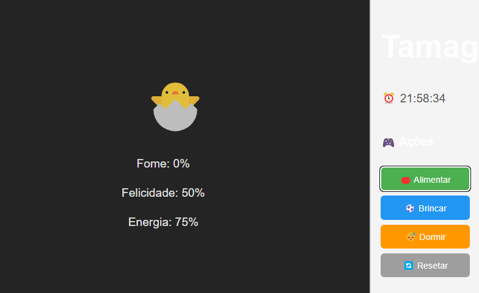

# 🐣 Tamagotchi Virtual

Um jogo simples de Tamagotchi feito com React + Vite e uma interface moderna. O usuário interage com um bichinho virtual que nasce de um ovo após 3 toques e pode ser alimentado, brincado e colocado para dormir.

## 🚀 Tecnologias Utilizadas

- React
- Vite
- JavaScript (ES6+)
- Firebase (opcional)
- CSS-in-JS (estilos embutidos)

## 📷 Funcionalidades

- ⏰ Assistir em tempo real
- 🥚 Ovo que choca após 3 cliques
- 🐣 Bichinho que anda na tela
- 🍎 Alimentar, ⚽ Brincar e 😴 Dormir
- 🔄 Reiniciar o estado do jogo
- 📦 Gaveta lateral com botões de ação

## 🖼️ Prévia




## ▶️ Como rodar o projeto localmente

1. Clone o repositório:
   ```bash
   git clone https://github.com/cristianosantanacosta/tamagoshi.git
   cd tamagoshi

